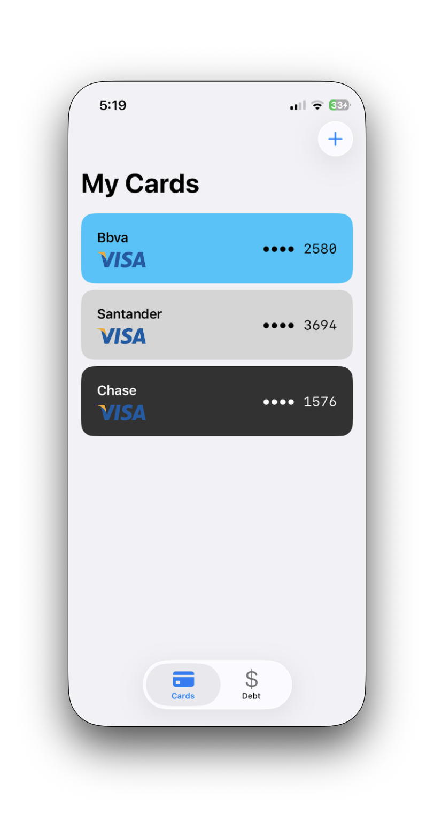
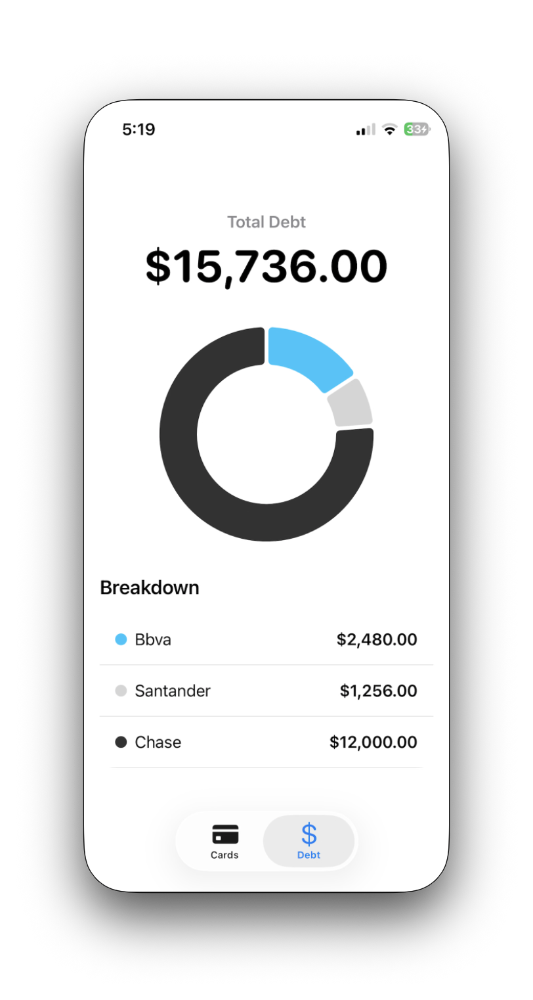
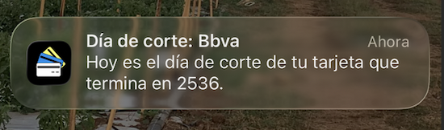

# RegistroTDC
### *The Ultimate Credit Card & Debt Tracker for iOS*

RegistroTDC is a sleek, modern, and secure iOS application designed to help you take control of your credit cards. With a premium, minimalist design inspired by Apple Wallet, it aggregates all your outstanding balances, tracks utilization limits, secures your PIN codes with Face ID, and schedules automatic alerts for your statement cut-off dates.

---

## Key Views & Features

### 1. My Cards Dashboard (*Tarjetas View*)
Keep your physical wallet thin by organizing all your credit cards in a single, stunning digital dashboard.
* **Premium Skeuomorphic Cards:** Cards are rendered as physical credit cards, dynamically styled with custom colors chosen by you.
* **Network Branding:** Automatic detection and logo rendering for major payment networks (Visa, Mastercard, and American Express).
* **At-a-Glance Info:** Displays the bank's name and masked card numbers (last 4 digits) for quick identification.

---

### 2. Card Details & Movement Ledger (*Detalle Tarjeta View*)
A comprehensive command center for each individual credit card.
* **Credit Limit Gauge:** A beautiful, color-coded visual indicator (green to yellow to red) comparing your current outstanding balance against your maximum credit limit.
* **Movement History:** A unified ledger showing all registered purchases and payments sorted chronologically (newest first).
* **Visual Ledger Coding:** Purchases appear in standard text, while payments/credits are highlighted in a distinct green color with a negative sign to show balance reduction.

---

### 3. Total Debt & Visual Insights (*Deuda View*)
Understand your financial obligations at a single glance with aggregated analytics.
* **Unified Balance Tracker:** Sums up the total credit used across all your credit cards.
* **Interactive Donut Chart:** A modern, clean chart showing the breakdown of your total debt per card, color-matched to the cards' physical designs.
* **Detailed Breakdown:** A list breakdown showcasing exactly how much you owe on each card.

---

### 4. Biometric Security & PIN Protection (*Nip View*)
Security is a priority. Protect your most sensitive credit card configurations.
* **Face ID Lock:** Access to sensitive card details is locked behind standard iOS biometrics (Face ID/Touch ID).
* **NIP Storage:** Securely view your card PIN code (NIP) only after passing biometric authorization.

| Biometric Authentication Screen | Secure PIN (NIP) Display |
|:---:|:---:|
|  |  |

---

### 5. Smart Cut-off Date Notifications
Never miss a payment deadline or forget your statement cut-off date again.
* **Automatic Reminders:** The app automatically schedules monthly notification alerts for the morning of each card's statement cut-off day.
* **Zero Overhead:** Reminders are managed dynamically based on your card setup.

---

## Technical Specifications
* **Framework:** SwiftUI
* **Database & Persistence:** SwiftData
* **Local Notifications:** UserNotifications Framework
* **Biometrics:** LocalAuthentication (Face ID & Touch ID)
* **Visuals:** Swift Charts & SF Symbols
